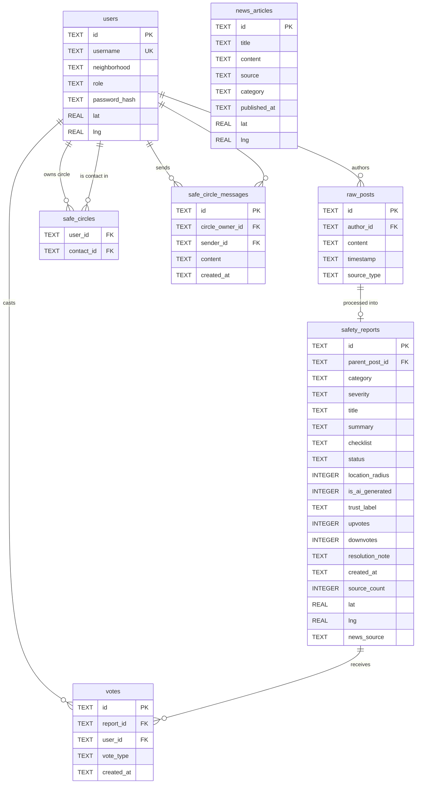

---
# Design Documentation: Community Guardian

## 1. Executive Summary

**Community Guardian** is a digital wellness and safety platform designed to mitigate "alert fatigue" and neighborhood panic. By utilizing a "Noise-to-Signal" AI filtering engine, the platform intercepts high-emotion, unverified social posts and transforms them into calm, factual, and actionable safety reports.

---

## 2. System Architecture

The application follows a decoupled Client-Server architecture with a focus on resilient data processing.

### 🧩 Components

* **Frontend (React/TypeScript):** A responsive SPA (Single Page Application) built with Vite. It features a "Calm UI" design system using a de-saturated color palette (blues/greens) to reduce user anxiety during emergencies.
* **Backend (Flask/Python):** A RESTful API that handles report ingestion, user authentication (synthetic), and the voting logic engine.
* **AI Engine (Gemini 3.0 Flash):** Processes raw text to extract entities (location, severity) and generates a "1-2-3 Checklist" for residents.
* **Fallback Layer:** A regex-based keyword engine that ensures the app remains functional if the AI service is unreachable or rate-limited.
* **Database (SQLite):** A lightweight relational store for users, raw posts, filtered reports, and community votes.

---

## 3. Tech Stack

| Layer | Technology | Reason for Selection |
| --- | --- | --- |
| **Frontend** | React 18 + TypeScript | Type safety for complex report states and rapid UI development. |
| **Styling** | Tailwind CSS | Rapid prototyping of the "Calm UI" design system. |
| **Backend** | Flask (Python) | Seamless integration with AI SDKs and lightweight overhead. |
| **AI** | Gemini 3.0 Flash | Low-latency inference for real-time text transformation. |
| **Database** | SQLite | Zero-config, file-based storage ideal for MVP and local testing. |
| **Testing** | Pytest & Vitest | Robust unit testing for backend logic and frontend component rendering. |

---

## 4. Key Design Patterns

### Noise-to-Signal Filtering

The core value prop of the app.

1. **Ingestion:** User submits a "Raw Post" (e.g., *"OMG FIRE EVERYONE RUN!"*).
2. **Transformation:** Gemini extracts the **Fact** (Fire), **Location** (Park), and **Urgency** (High).
3. **Output:** The UI displays a de-escalated report: *"Reported Fire near Central Park. Status: Active. Actions: 1. Avoid 5th Ave. 2. Close Windows..."*

### Community Trust Lifecycle

To prevent the spread of misinformation, reports undergo a state-change based on community input:

* **AI Generated:** Initial state for processed posts.
* **Community Verified:** Triggered by 3+ upvotes (and an upvote/downvote ratio > 2:1).
* **Flagged:** Triggered when downvotes exceed upvotes by a specific threshold.

---

## 5. Data & Privacy

* **Anonymization:** The system uses neighborhood-level geofencing rather than precise GPS coordinates to protect user privacy.
* **Synthetic Data:** All current user profiles and "Safe Circles" are synthetic prototypes.
* **Security:** API keys are managed via environment variables and are never committed to version control.

---

## 6. Future Enhancements

If granted further development time, the following features would be prioritized:

### 🛠️ Technical Debt & Security

* **JWT Authentication:** Move from synthetic user IDs to a robust OAuth2/JWT-based login system.
* **End-to-End Encryption:** Implement E2EE for the "Safe Circle" private messaging and status updates.

### 🌟 New Features

* **Bluetooth Mesh Support:** Allow users to send "Safe/Not Safe" pings during internet outages (essential for disaster scenarios).
* **Identity Verification:** Integrate third-party verification (e.g., Clear or government ID) for "Verified Resident" badges to increase signal trust.
* **Automated Spam Avoidance:** Train a custom classifier to filter out non-safety-related neighborhood "noise" (e.g., lost pets or general complaints).
* **Multi-Channel Notifications:** SMS and Push notification integration for high-severity "Signal" reports.

---

---

## 7. API Reference

All endpoints are prefixed with `http://localhost:5001`. Authenticated endpoints require the header:
```
Authorization: Bearer <token>
```

### Auth

| Method | Endpoint | Auth | Description |
|--------|----------|------|-------------|
| `POST` | `/api/login` | — | Authenticate an existing user |
| `POST` | `/api/signup` | — | Register a new user |
| `GET` | `/api/me` | ✓ | Return the current user's profile |
| `PATCH` | `/api/me/location` | ✓ | Update the current user's GPS coordinates |
| `POST` | `/api/logout` | ✓ | Invalidate the current session token |

#### `POST /api/login`
```json
// Request
{ "username": "maria", "password": "pass123" }

// Response 200
{ "token": "<uuid>", "user": { "id": "user_001", "username": "maria", "neighborhood": "North End", "role": "Guardian", "lat": 40.4401, "lng": -86.9077 } }
```

#### `POST /api/signup`
```json
// Request
{ "username": "newuser", "password": "secret99", "neighborhood": "West Side", "lat": 40.427, "lng": -86.907 }

// Response 201
{ "token": "<uuid>", "user": { "id": "user_<hex>", ... } }
```

#### `PATCH /api/me/location`
```json
// Request
{ "lat": 40.4275, "lng": -86.9077 }

// Response 200 — updated user object
```

---

### Reports

| Method | Endpoint | Auth | Description |
|--------|----------|------|-------------|
| `GET` | `/api/reports` | — | List reports, with optional filters |
| `POST` | `/api/reports` | — | Submit a raw post; AI processes into a report |
| `PATCH` | `/api/reports/:id` | — | Resolve a report |

#### `GET /api/reports` — Query Parameters

| Param | Values | Description |
|-------|--------|-------------|
| `category` | `local` \| `digital` | Filter by category |
| `status` | `active` \| `resolved` | Filter by status |
| `severity` | `Low` \| `Medium` \| `High` | Filter by severity |
| `search` | string | Full-text search on title and summary |
| `lat` | float | User latitude (enables proximity filter) |
| `lng` | float | User longitude (enables proximity filter) |
| `radius_km` | float (default `10`) | Radius in km for proximity filter |

#### `POST /api/reports`
```json
// Request
{
  "content": "There is a fire on Salisbury St!",
  "category": "local",
  "author_id": "user_002",
  "lat": 40.4401,
  "lng": -86.9077
}

// Response 201 — SafetyReport object
// Response 200 — if merged into an existing report (source_count incremented)
```

#### `PATCH /api/reports/:id`
```json
// Request
{ "status": "Resolved", "resolution_note": "Fire extinguished by crews." }

// Response 200 — updated SafetyReport object
```

#### SafetyReport Object
```json
{
  "id": "rep_001",
  "parent_post_id": "post_001",
  "category": "Local_Physical",
  "severity": "High",
  "title": "Structure Fire: North Salisbury Street",
  "summary": "A fire has been reported...",
  "checklist": ["Avoid the area.", "Close windows.", "Check city alerts."],
  "status": "Active",
  "location_radius": 800,
  "is_ai_generated": true,
  "trust_label": "community_verified",
  "upvotes": 5,
  "downvotes": 1,
  "resolution_note": null,
  "created_at": "2026-03-07T12:00:00Z",
  "source_count": 2,
  "lat": 40.4401,
  "lng": -86.9077,
  "news_source": "Journal & Courier: Firefighters respond to blaze on N. Salisbury St"
}
```

---

### Votes

| Method | Endpoint | Auth | Description |
|--------|----------|------|-------------|
| `POST` | `/api/reports/:id/vote` | — | Cast, switch, or retract a vote |

#### `POST /api/reports/:id/vote`
```json
// Request
{ "user_id": "user_001", "vote_type": "up" }

// Response 200
{ "upvotes": 6, "downvotes": 1, "trust_label": "community_verified", "user_vote": "up" }
```

Voting the same direction a second time **retracts** the vote. Voting the opposite direction **switches** it.

**Trust label transitions (auto-computed on every vote):**

| Condition | Label |
|-----------|-------|
| upvotes ≥ 3 AND up/down ratio > 2:1 | `community_verified` |
| downvotes > upvotes + 2 | `flagged` |
| Otherwise | unchanged |

---

### Safe Circles

| Method | Endpoint | Auth | Description |
|--------|----------|------|-------------|
| `GET` | `/api/circles/mine` | ✓ | People the caller has added to their circle |
| `GET` | `/api/circles/memberships` | ✓ | Circles the caller has been added to |
| `POST` | `/api/circles/members` | ✓ | Add a user to the caller's circle |
| `DELETE` | `/api/circles/members/:contact_id` | ✓ | Remove a user from the caller's circle |
| `GET` | `/api/circles/:owner_id/messages` | ✓ | Fetch chat history for a circle |
| `POST` | `/api/circles/:owner_id/messages` | ✓ | Send a message to a circle chat |

#### `POST /api/circles/members`
```json
// Request
{ "contact_id": "user_003" }

// Response 201
{ "id": "user_003", "username": "aisha", "neighborhood": "Eastside", "role": "User" }
```

#### `POST /api/circles/:owner_id/messages`
```json
// Request
{ "content": "Is everyone okay?" }

// Response 201
{ "id": "msg_<hex>", "content": "Is everyone okay?", "created_at": "...", "sender_id": "user_001", "sender_name": "maria" }
```

---

### Users & Health

| Method | Endpoint | Auth | Description |
|--------|----------|------|-------------|
| `GET` | `/api/users` | — | List all users; supports `?search=` for username lookup |
| `GET` | `/api/health` | — | Server and AI service status check |

---

## 8. Database ERD

